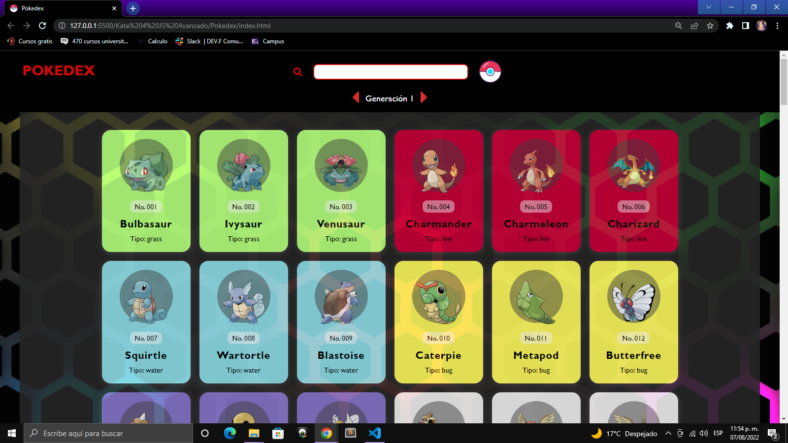

# Pokedex

Aplicacion que hace consultas simples a la  API de Pokemon. Esta se compone de un buscador, en cual se puede buscar mediante el nombre del pokemon o su numero de ID asi mismo contiene las generaciones de los pokemons las cuales se muestran en un contenedor de tarjetas y estas a su vez se pueden ir cambiando mediante las flechas que aparecen abajo del buscador. 

## Tecnologías

* HTML
* CSS
* JavaScript
* PokeApi

## Pantallas del proyecto

**Resultado de buscar un pokemon**

